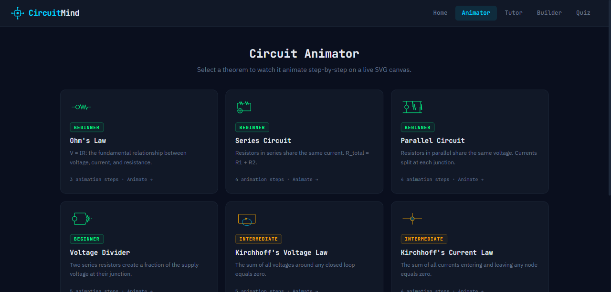
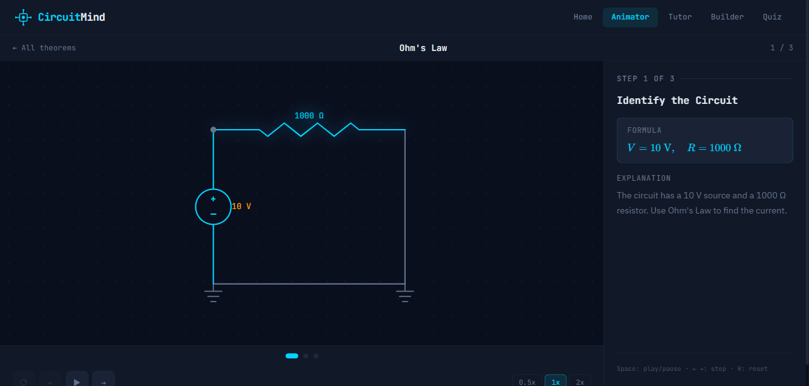
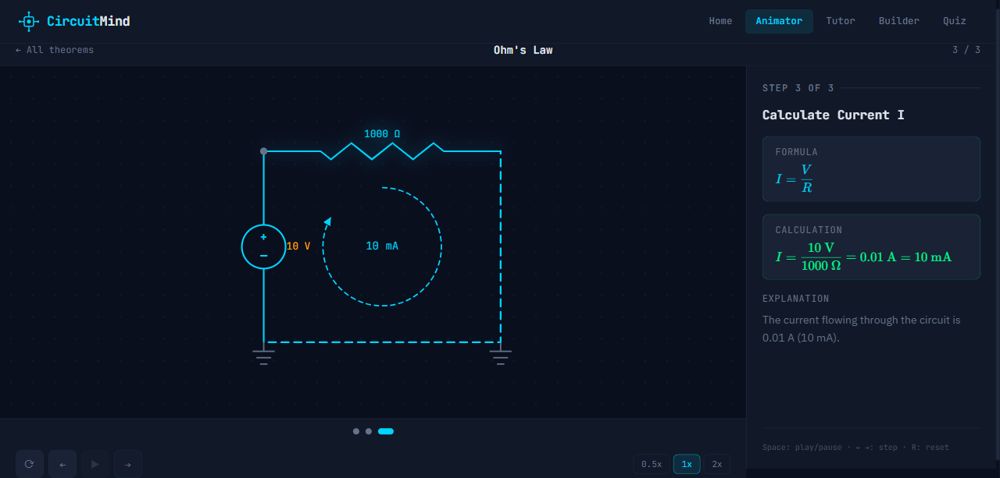
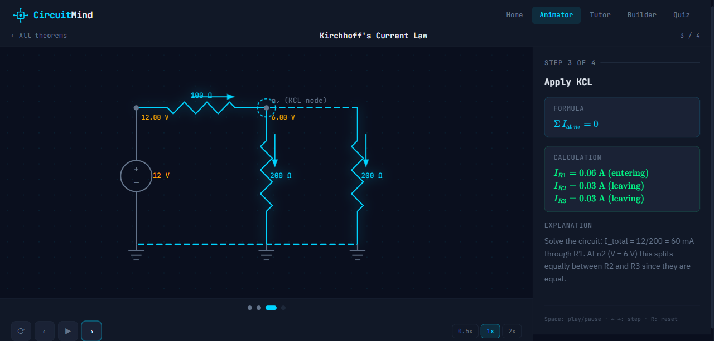
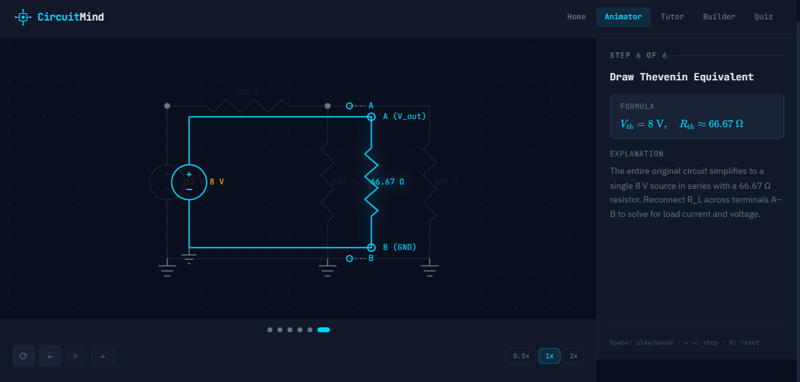

# CircuitMind

An interactive circuit learning web app that animates electrical theorems step-by-step on a live SVG canvas. Built with React, Vite, and Tailwind CSS — no circuit simulation libraries, no animation frameworks.

---

## Screenshots

### Theorem Selector


### Ohm's Law — KaTeX Formula Rendering


### Ohm's Law — Live Current Flow Animation


### Kirchhoff's Current Law — T-Junction with Branch Arrows


### Thevenin's Theorem — Final Equivalent Circuit


---

## Features

- **9 animated tutorials** — Ohm's Law, Series, Parallel, Voltage Divider, KVL, KCL, Superposition, Thevenin, Norton
- **KaTeX math rendering** — formulas and calculations display as properly typeset mathematics
- **Live SVG animation** — current flow, directional arrows, voltage annotations, element highlights driven by declarative step hints
- **Step-by-step playback** — play/pause, manual stepping, variable speed (0.5x, 1x, 2x), timeline scrubbing
- **Zero external circuit libraries** — MNA solver and Gaussian elimination implemented from scratch
- **Dark theme** — blueprint-grid canvas with cyan accent on `#0a0f1e` background

---

## Tutorials

| Tutorial | Difficulty | Steps |
|---|---|---|
| Ohm's Law | Beginner | 3 |
| Series Circuit | Beginner | 4 |
| Parallel Circuit | Beginner | 4 |
| Voltage Divider | Beginner | 5 |
| Kirchhoff's Voltage Law | Intermediate | 5 |
| Kirchhoff's Current Law | Intermediate | 4 |
| Superposition | Advanced | 4 |
| Thevenin's Theorem | Advanced | 6 |
| Norton's Theorem | Advanced | 6 |

---

## Getting Started

```bash
npm install
npm run dev
```

Open `http://localhost:5173` and click any theorem card to start.

---

## QA Pipeline

The project includes a visual QA workflow that captures tutorial screenshots, sends them to Gemini for review, and auto-applies fixes via Claude Code.

```bash
# Full pipeline: capture PDFs -> Gemini review -> Claude fixes -> git diff
npm run qa

# Shortcuts
npm run qa -- --skip-capture    # skip PDF capture, reuse existing
npm run qa -- --skip-gemini     # skip Gemini, reapply saved review
npm run qa -- --dry-run         # preview fixes without applying
```

---

## Tech Stack

- **React 18** + **Vite 6**
- **Tailwind CSS** — dark theme, utility classes
- **KaTeX** — math formula rendering
- **Playwright** — visual QA screenshots and PDF capture
- **Custom MNA solver** — Modified Nodal Analysis with Gaussian elimination from scratch

---

## Project Structure

```
src/
  components/
    animator/
      CircuitAnimator.jsx     # main SVG canvas + step rendering
      AnimationStep.jsx       # right-panel step card with KaTeX
      elements/               # AnimatedResistor, VoltageSource, Wire, Node
      sequences/              # one file per tutorial
    MathText.jsx              # KaTeX rendering component
  engine/
    CircuitGraph.js           # graph model (ES6 Map)
    MNASolver.js              # MNA matrix solver
    StepTracer.js             # records graph state at each step
    TheoremEngine.js          # high-level theorem analysis
  hooks/
    useAnimationSequence.js   # playback state management
scripts/
  capture_tutorials.py        # screenshot every step -> PDF
  gemini_to_claude.py         # fetch Gemini review -> run Claude Code
  qa.py                       # full QA pipeline orchestrator
```
